# Autonomous Testing Bot
This project implements an autonomous testing bot that learns from user interactions using a hybrid deep learning approach and performs automated testing using PyTorch Lightning and Playwright.

## Architecture Overview
The system consists of three main components:
1. **Interaction Recorder**: Records user interactions with the website
2. **Hybrid Interaction Learner**: Trains a deep learning model with automated hyperparameter optimization
3. **Automated Tester**: Executes automated tests based on learned patterns

## Workflow Diagram

```mermaid
%%{init: { 'theme': 'base', 'themeVariables': { 'fontSize': '16px' } }}%%
graph TB
    subgraph Recording[" Recording Phase "]
        direction TB
        A[/"👤 User Interaction"/]:::input -->|Records| B["📝 Interaction Recorder"]
        B -->|Saves| C[("💾 JSON Data")]:::data
        style Recording fill:#e1f5fe,stroke:#01579b,stroke-width:2px
    end

    subgraph Learning[" Learning Phase "]
        direction TB
        C -->|Feeds into| D["🔧 Feature Engineering"]
        D -->|Processes| E["🧠 Hybrid Model"]
        E -->|Optimizes| F["⚙️ Hyperparameter Tuning"]
        F -->|Trains| G[("📊 Final Model")]:::data
        style Learning fill:#f3e5f5,stroke:#4a148c,stroke-width:2px
    end

    subgraph Testing[" Testing Phase "]
        direction TB
        G -->|Guides| H["🤖 Automated Tester"]
        H -->|Executes| I["🌐 Website Tests"]
        I -->|Generates| J["📋 HTML Reports"]:::output
        style Testing fill:#e8f5e9,stroke:#1b5e20,stroke-width:2px
    end

    %% Node styles
    classDef default fill:#fff,stroke:#333,stroke-width:1px,rx:5px,ry:5px
    classDef input fill:#bbdefb,stroke:#1976d2,stroke-width:2px
    classDef data fill:#fff9c4,stroke:#f57f17,stroke-width:2px
    classDef output fill:#c8e6c9,stroke:#2e7d32,stroke-width:2px

    %% Link styles
    linkStyle default stroke:#666,stroke-width:2px
```


## Usage
### Recording and Training
1. Start the recording session to collect interaction data:
```bash
python -m src.bot.main --url "https://www.leasingmarkt.de" --duration 240
```
This will:
- Open a browser window for you to interact with the website
- Record your interactions for 4 minutes (configurable via --duration)
- Save the recorded interactions to `src/bot/data/recorded_interactions.json`

2. Train the model using recorded data:
```bash
python -m src.bot.main --train-only
```
The training process:
- Loads recorded interactions from `src/bot/data/recorded_interactions.json`
- Performs feature engineering on the interaction data
- Uses Optuna for hyperparameter optimization
- Trains the hybrid model using the optimal parameters
- Saves the trained model to `src/bot/data/trained_model.joblib`

Training parameters can be customized:
```bash
python -m src.bot.main --train-only --epochs 100 --batch-size 32 --learning-rate 0.001
```

### Running Autonomous Tests
Run tests using the trained model:
```bash
python -m src.bot.autonomous_lm_test
```
This will:
- Load the trained model from `src/bot/data/trained_model.joblib`
- Start automated testing on https://www.leasingmarkt.de
- Run for 3 minutes (default duration)
- Generate an HTML report in the `reports` directory

Customize test execution:
```bash
# Run tests for a specific duration (in seconds)
python -m src.bot.autonomous_lm_test --duration 300

# Run tests on a different URL
python -m src.bot.autonomous_lm_test --url "https://www.leasingmarkt.de/some-page"

# Run in headless mode (useful for CI/CD)
GITHUB_ACTIONS=true python -m src.bot.autonomous_lm_test
```

### Test Reports
After each test run, a detailed HTML report is generated in the `reports` directory. The report includes:
- Test timeline with start and end times
- Success rate and statistics
- Detailed breakdown of all interactions
- Failed assertions and errors (if any)
- Interactive collapsible sections for easy navigation

View the report by opening `reports/index.html` in your web browser.

### Tips for Better Results
1. **Quality Training Data**:
   - Interact naturally with the website during recording
   - Cover different types of interactions (clicks, form fills, navigation)
   - Include both positive and negative test cases

2. **Model Training**:
   - Start with default parameters
   - Use longer training epochs for better accuracy
   - Monitor training logs for convergence

3. **Test Execution**:
   - Run multiple test sessions to ensure consistency
   - Use longer durations for comprehensive testing
   - Check HTML reports for insights and improvements

### CI/CD Integration
Test reports are available in two formats:
1. **GitHub Pages (Latest Report)**
   - Visit https://tamaltanudatta.github.io/AI-ARTEM/
   - This page is automatically updated after each test run

2. **GitHub Actions Artifacts**
   - Available in the Actions tab of the repository
   - Contains full test results and screenshots
   - Stored for 14 days

## Technology Stack
- **PyTorch Lightning**: Deep learning framework for model training
- **Optuna**: Hyperparameter optimization
- **Playwright**: Browser automation
- **scikit-learn**: Data preprocessing and feature engineering
- **NumPy & Pandas**: Data manipulation

## Setup Instructions
1. Create a virtual environment:
```bash
python -m venv venv
source venv/bin/activate  # On Windows: venv\Scripts\activate
```

2. Install dependencies:
```bash
pip install -r requirements.txt
```

3. Install Playwright browsers:
```bash
playwright install
```

## Model Architecture
The hybrid model combines traditional ML with deep learning:
```
Input Features → Preprocessing → Neural Network → Predictions
     ↓              ↓                  ↓             ↓
[Raw Data]    [StandardScaler]  ┌──────────────┐  [Actions]
   ↓          [LabelEncoder]    │ Dense Layer  │     ↓
[Features]          ↓           │    (64)      │  [Website]
   ↓           [Processed]      │   Dropout    │
[Position]          ↓           │ Dense Layer  │
[Time]        [Normalized]      │    (32)      │
[Events]            ↓           │   Dropout    │
[Context]     [Training Data]   │ Output Layer │
                               └──────────────┘
                                      ↑
                               [Optuna Tuning]
```

### Components:
1. **Input Processing**
   ```
   Raw Interaction → Feature Extraction → Normalized Features
   [User Events] → [Engineering] → [Scaled Data]
   ```

2. **Model Layers**
   ```
   Input Layer (N) → Hidden Layer (64) → Hidden Layer (32) → Output Layer (M)
        ↓                 ↓                    ↓                   ↓
   [Features] → [ReLU + Dropout] → [ReLU + Dropout] → [Softmax Output]
   ```

3. **Optimization Flow**
   ```
   Hyperparameters → Training → Validation → Tuning
   [Optuna Trial] → [Train] → [Evaluate] → [Optimize]
         ↓            ↓           ↓            ↓
   [Layer Sizes]  [Learning]  [Metrics]  [Best Model]
   [Learn Rate]     [Loss]     [Score]
   ```

The hybrid model combines:
1. **Traditional ML**:
   - StandardScaler for feature normalization
   - Label encoding for interaction types
   - Feature engineering for web-specific attributes

2. **Deep Learning**:
   - Multi-layer neural network
   - Dropout for regularization
   - ReLU activation
   - Softmax output for interaction type prediction

3. **Hyperparameter Optimization**:
   - Automated tuning using Optuna
   - Optimizes:
     - Hidden layer sizes
     - Learning rates
     - Training parameters

## Components
### InteractionRecorder
- Records user clicks, inputs, navigation, and viewport interactions
- Saves interaction data in JSON format
- Captures temporal and spatial features

### HybridInteractionLearner
- Uses PyTorch Lightning for deep learning
- Implements automated hyperparameter optimization with Optuna
- Features:
  - Dropout layers for regularization
  - Advanced feature engineering
  - Time-based sequence learning
  - Viewport and scroll position tracking
  - Standardized preprocessing

### AutomatedTester
- Uses the trained deep learning model
- Analyzes webpage elements using learned patterns
- Makes probabilistic decisions for interactions
- Adapts to different viewport sizes and page states
